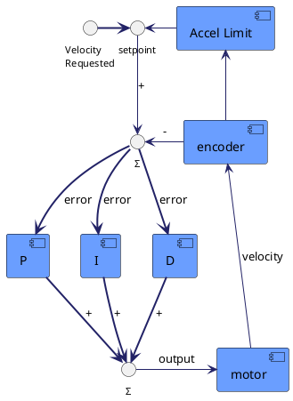

```plantuml
@startuml
skinparam componentStyle uml2
skinparam interface{
    FontSize  11
    FontWeight bold
}
skinparam component {
    FontColor          black
    AttributeFontColor black
    FontSize           14
    AttributeFontSize  12
    AttributeFontname  Droid Sans Mono
    BackgroundColor    #6A9EFF
    BorderColor        black
    ArrowColor         #222266
}

interface "Velocity\nRequested" as requiredSetpoint
interface setpoint
interface "Σ" as sigma
interface "Σ" as error
requiredSetpoint =right=> setpoint
setpoint -down-> error : "+"
[Accel Limit] as accelLimit
error =down=> [P] : "error"
error =down=> [I] : "error"
error =down=> [D] : "error"
[P] =down=> sigma : "+"
[I] =down=> sigma : "+"
[D] =down=> sigma : "+"
sigma -> [motor] : "output"
[motor] -up-> [encoder] : "velocity"
encoder -left-> error : "-"
encoder -up-> accelLimit
accelLimit -left-> setpoint

@enduml
```